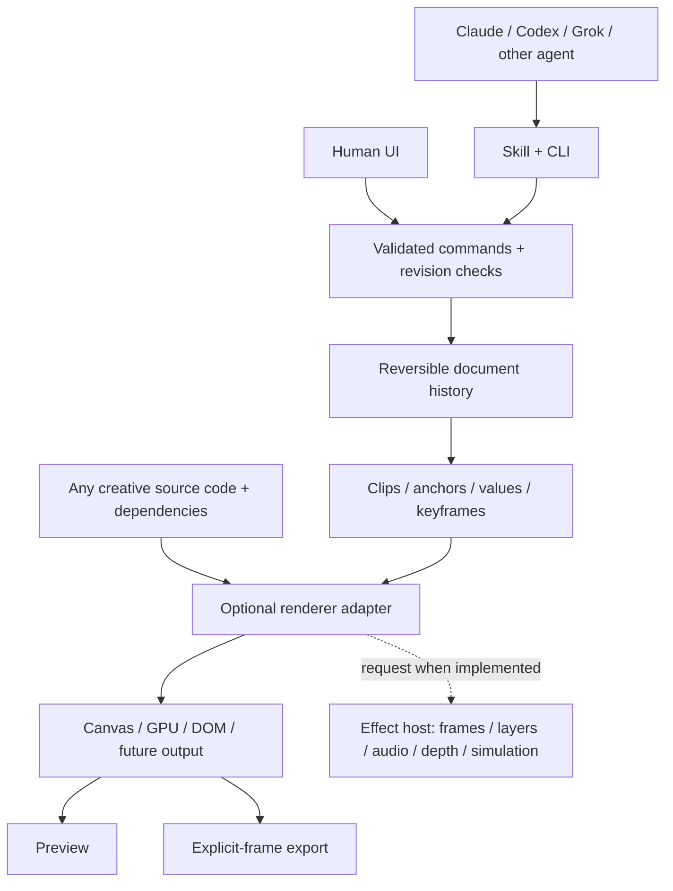

# Architecture: open code, addressable edits

## Boundaries

`packages/core` knows authoring values and clocks; it does not draw scenes. A template exposes stable anchors with typed properties. A renderer receives sampled values and explicit source time. A new library does not need to fit an existing set of scene primitives.

`Studio` validates candidate edits before committing them and records before/after patches. Batches are atomic. History can compact to a base snapshot within its byte budget. The authoring core still copies whole documents for edits; it is a reference implementation, not proof of large-timeline scalability. Persistent maps, segment checkpoints, indexed dependencies and worker scheduling are future work.

The CLI adds a file-content revision and exclusive edit lock, so a proposal survives process boundaries and detects another writer. Its temporary-file rename prevents truncated projects. The in-memory browser revision is scoped to a session. Project previews send revision-checked commands to the loopback project server; standalone studies download edits. The server only edits its opened project.

Source/dependency bindings protect saved projects against silently changed code. The generic project binding includes the bundled renderer and core. Source edits require explicit rebind. Compatible schemas retain history; --reset archives the old project and adopts new defaults. The CLI snapshots original/bundled source and core, but media manifests pin retained project-local assets; render preparation copies and verifies them into a frozen snapshot. Rich schema migrations are planned. JSON stores editable state and history; it does not store or restrict all possible rendering code.

## Renderer and host extension points

`AdapterRegistry` supports versioned adapters with `create(context)` returning `render(frame)`. An adapter can declare required host services. `createEffectHost` supplies only real implementations; missing services produce an explicit error. The initial demos include direct rendering paths as well as this optional registry. They do not yet all route through a single scheduler.

The beta media host supplies `frameAt` and editable `portFrame`. General `layerAt`, `audioAt`, `maskAt`, `depthAt`, and `simulationAt` services remain extension work. Frame identity must include source revision, time, quality, color and effect order. Temporal effects must define whether they sample original source or upstream composition. Do not fake frame history by repeatedly drawing the same current frame.

## Implemented and proposed

Implemented: authoring core, disk-backed panel editor, revision-checked agent proposals, procedural Canvas/Three/WebGL2 studies, floating-point effects, device lighting, shared clip compositor, PTS-indexed local media frames, static audio-port mixing, rational frame exports and RGBA/ProRes transparency. See beta.md for the exact supported contract.

Proposed: streaming/hardware media decode, depth/ID sources, audio automation, untrusted-code sandboxing, distributed scheduling, EffectCraft/WASM bridge, richer DOM capture, device-profile unification and explicit schema migration maps.

New custom code remains supported even when it exposes no editable controls. Unknown capabilities must not be discarded or converted to a smaller primitive vocabulary. In this beta, unknown template adapters prevent loading rather than mutating the saved document.

## Visual checks

Effect studies currently use exact same-browser repeated-frame comparisons. Creative Canvas/3D film studies additionally measure pixel differences: fewer than 0.1% of pixels may differ and mean RGB-channel error must stay below 0.02 on a 0–255 scale. On the founding Mac run, warmed antialiased edges in two vector scenes changed a few dozen pixels while other repeated frames matched exactly. This is a rendering tolerance, not a guarantee of byte-identical frames across browsers, GPUs or font installations.
